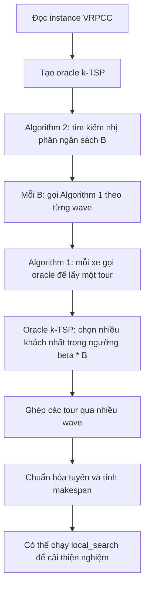

# Giải thích code thuật toán xấp xỉ VRPCC

File này dùng để đọc khi báo cáo, không cần mở lại source code. Nội dung bám theo các file chính:

- `vrpcc/approx_algorithm.py`: thuật toán xấp xỉ chính.
- `vrpcc/k_tsp_oracle.py`: oracle k-TSP dùng bên trong thuật toán chính.
- `vrpcc/local_search.py`: bước cải thiện nghiệm sau khi có nghiệm xấp xỉ.
- `vrpcc/instance.py`: cấu trúc dữ liệu instance và các hàm tính chi phí.

## 1. Bài toán và ký hiệu trong code

Bài toán đang xử lý là VRPCC, tức bài toán định tuyến xe có ràng buộc tương thích giữa xe và khách hàng.

- Đỉnh `0` là depot, tức kho xuất phát và kết thúc.
- Các khách hàng là các đỉnh `1, 2, ..., n - 1`.
- `m` là số xe.
- `dist[i, j]` là chi phí hoặc khoảng cách đi từ đỉnh `i` đến đỉnh `j`.
- `u[k, j] = 1` nghĩa là xe `k` được phép phục vụ khách hàng `j`.
- `u[k, j] = 0` nghĩa là xe `k` không được phép phục vụ khách hàng `j`.
- Một tuyến xe luôn là chu trình đóng dạng `[0, ..., 0]`.
- `makespan` là chi phí lớn nhất trong các tuyến xe, tức mục tiêu cần giảm.
- `B` là ngân sách thử trong quá trình tìm kiếm nhị phân.
- `beta` là hệ số xấp xỉ của oracle k-TSP.
- `eps` là độ chính xác dừng của tìm kiếm nhị phân.

### 1.1. Dữ liệu đầu vào trong `MIP/data_paper_101`

Thư mục input đang dùng là:

```text
MIP/data_paper_101
```

Đây là bộ dữ liệu kiểu bài báo, được tạo từ Solomon benchmark và thêm ma trận tương thích giữa xe và khách hàng.

Cấu trúc thư mục:

```text
MIP/data_paper_101/
├── manifest.csv
├── manifest.json
├── tight/
│   ├── c-n21-k6/c-n21-k6.json
│   ├── r-n21-k6/r-n21-k6.json
│   ├── RC-n21-k6/RC-n21-k6.json
│   └── ...
└── relaxed/
    ├── c-n21-k6/c-n21-k6.json
    ├── r-n21-k6/r-n21-k6.json
    ├── RC-n21-k6/RC-n21-k6.json
    └── ...
```

Ý nghĩa hai thư mục chính:

| Thư mục | Xác suất tương thích | Ý nghĩa |
|---|---:|---|
| `tight` | `0.3` | Ràng buộc chặt hơn, mỗi khách thường tương thích với ít xe hơn. |
| `relaxed` | `0.7` | Ràng buộc lỏng hơn, mỗi khách thường tương thích với nhiều xe hơn. |

Trong mỗi mức `tight` hoặc `relaxed` có 15 instance:

| Nhóm layout | Ý nghĩa | Các kích thước |
|---|---|---|
| `c` | Clustered, khách hàng phân cụm. | `n21-k6`, `n41-k10`, `n61-k14`, `n81-k18`, `n101-k22` |
| `r` | Random, khách hàng phân bố ngẫu nhiên. | `n21-k6`, `n41-k10`, `n61-k14`, `n81-k18`, `n101-k22` |
| `RC` | Vừa random vừa clustered. | `n21-k6`, `n41-k10`, `n61-k14`, `n81-k18`, `n101-k22` |

Tên instance có dạng:

```text
c-n21-k6
```

Đọc như sau:

- `c`: loại layout, ở đây là clustered.
- `n21`: tổng số đỉnh là `21`, gồm 1 depot và 20 khách hàng.
- `k6`: số xe là `6`.

Vì vậy:

| Tên | Tổng số đỉnh | Số khách hàng | Số xe |
|---|---:|---:|---:|
| `n21-k6` | 21 | 20 | 6 |
| `n41-k10` | 41 | 40 | 10 |
| `n61-k14` | 61 | 60 | 14 |
| `n81-k18` | 81 | 80 | 18 |
| `n101-k22` | 101 | 100 | 22 |

### 1.2. File `manifest.csv` và `manifest.json`

Hai file `manifest` là bảng mô tả toàn bộ input trong thư mục.

Các cột quan trọng:

| Cột | Ý nghĩa |
|---|---|
| `suite` | Tên bộ dữ liệu, ở đây là `up_to_101`. |
| `level` | Mức tương thích: `tight` hoặc `relaxed`. |
| `instance_name` | Tên instance, ví dụ `c-n21-k6`. |
| `n_nodes` | Tổng số đỉnh, gồm depot. |
| `m_vehicles` | Số xe. |
| `layout` | Kiểu phân bố tọa độ: `C`, `R`, hoặc `RC`. |
| `compat_prob` | Xác suất sinh tương thích giữa xe và khách. |
| `seed` | Seed dùng để sinh ma trận tương thích. |
| `source_file` | File Solomon gốc, ví dụ `c101.txt`. |
| `source_path` | Đường dẫn file Solomon gốc. |
| `output_path` | Đường dẫn file JSON instance được tạo ra. |

Ví dụ một dòng trong `manifest.csv`:

```text
up_to_101,tight,c-n21-k6,21,6,C,0.3,1313,25,c101.txt,raw_data/solomon/25/c101.txt,MIP/data_paper_101/tight/c-n21-k6/c-n21-k6.json
```

Giải thích dòng này:

- Instance thuộc bộ `up_to_101`.
- Mức tương thích là `tight`.
- Tên instance là `c-n21-k6`.
- Có `21` đỉnh, tức 1 depot và 20 khách.
- Có `6` xe.
- Layout là `C`, tức clustered.
- Xác suất tương thích là `0.3`.
- Seed sinh dữ liệu là `1313`.
- Tọa độ lấy từ file Solomon `c101.txt`.
- File JSON đầu ra nằm ở `MIP/data_paper_101/tight/c-n21-k6/c-n21-k6.json`.

### 1.3. Cấu trúc một file JSON input

Ví dụ file:

```text
MIP/data_paper_101/tight/c-n21-k6/c-n21-k6.json
```

Các khóa chính trong JSON:

| Trường | Kiểu dữ liệu | Ý nghĩa |
|---|---|---|
| `name` | chuỗi | Tên instance. |
| `n` | số nguyên | Tổng số đỉnh, gồm depot. |
| `m` | số nguyên | Số xe. |
| `prob_compat` | số thực | Xác suất sinh tương thích. |
| `layout` | chuỗi | Kiểu phân bố tọa độ: `C`, `R`, hoặc `RC`. |
| `coords` | ma trận `n x 2` | Tọa độ 2D của depot và khách hàng. |
| `c` | ma trận `n x n` | Ma trận chi phí/khoảng cách giữa các đỉnh. |
| `u` | ma trận `m x n` | Ma trận tương thích xe-khách. |

Đoạn JSON mẫu có chú thích:

```jsonc
{
  "name": "c-n21-k6",       // Tên instance.
  "n": 21,                  // Tổng số đỉnh: 1 depot + 20 khách hàng.
  "m": 6,                   // Số xe.
  "prob_compat": 0.3,       // Xác suất sinh tương thích, tight dùng 0.3.
  "layout": "C",            // C nghĩa là clustered, khách hàng phân cụm.
  "coords": [               // Danh sách tọa độ của các đỉnh.
    [40.0, 50.0],           // Đỉnh 0 là depot.
    [45.0, 68.0],           // Đỉnh 1 là khách hàng 1.
    [45.0, 70.0]            // Đỉnh 2 là khách hàng 2.
  ],
  "c": [                    // Ma trận khoảng cách n x n.
    [0.0, 18.68, 20.61],    // Hàng 0: khoảng cách từ depot đến các đỉnh khác.
    [18.68, 0.0, 2.0],      // Hàng 1: khoảng cách từ khách 1 đến các đỉnh khác.
    [20.61, 2.0, 0.0]       // Hàng 2: khoảng cách từ khách 2 đến các đỉnh khác.
  ],
  "u": [                    // Ma trận tương thích m x n.
    [1.0, 0.0, 0.0],        // Xe 0: được phép đi depot, chưa chắc phục vụ khách 1, 2.
    [1.0, 0.0, 0.0],        // Xe 1: depot luôn bằng 1.
    [1.0, 1.0, 0.0]         // Xe 2: được phép phục vụ khách 1, không phục vụ khách 2.
  ]
}
```

Lưu ý: đoạn trên là bản rút gọn để giải thích. File thật có đủ `21` dòng tọa độ, ma trận `c` kích thước `21 x 21`, và ma trận `u` kích thước `6 x 21`.

### 1.4. Ý nghĩa chi tiết của `coords`, `c`, `u`

`coords`:

- Là tọa độ 2D của các đỉnh.
- `coords[0]` là tọa độ depot.
- `coords[j]` với `j >= 1` là tọa độ khách hàng `j`.
- Thuật toán xấp xỉ không bắt buộc dùng `coords` để tính nghiệm.
- `coords` chủ yếu dùng để vẽ hình tuyến đường.

`c`:

- Là ma trận chi phí hoặc khoảng cách.
- `c[i][j]` là chi phí đi từ đỉnh `i` sang đỉnh `j`.
- Ma trận này đối xứng, tức `c[i][j] = c[j][i]`.
- Đường chéo chính bằng `0`, tức `c[i][i] = 0`.
- Code đọc trường này thành `inst.dist`.
- Nếu JSON dùng tên `dist` thay vì `c` thì code cũng đọc được.

`u`:

- Là ma trận tương thích giữa xe và đỉnh.
- `u[k][j] = 1` nghĩa là xe `k` được phép phục vụ đỉnh `j`.
- `u[k][j] = 0` nghĩa là xe `k` không được phép phục vụ đỉnh `j`.
- Cột `j = 0` là depot, nên thường `u[k][0] = 1` với mọi xe `k`.
- Với mỗi khách hàng `j >= 1`, dữ liệu bảo đảm có ít nhất một xe tương thích để bài toán có khả năng có nghiệm.

Ví dụ đọc một hàng của `u`:

```text
u[0] = [1, 0, 0, 0, 1, 1, ...]
```

Nghĩa là:

- Xe `0` được phép đi depot vì `u[0][0] = 1`.
- Xe `0` không được phục vụ khách `1`, `2`, `3`.
- Xe `0` được phục vụ khách `4`, `5`.

### 1.5. Input đi vào thuật toán như thế nào?

Khi chạy chương trình, file JSON được đọc bằng:

```python
inst = VRPCCInstance.load_json(p)  # Đọc file JSON từ đường dẫn p.
```

Sau đó `VRPCCInstance.from_dict` xử lý dữ liệu:

```python
dist_key = "dist" if "dist" in d else "c"  # Nếu JSON có dist thì dùng dist, nếu không thì dùng c.
dist_raw = np.array(d[dist_key], dtype=np.float64)  # Chuyển ma trận khoảng cách sang numpy.
u_raw = np.array(d["u"], dtype=np.int8)  # Chuyển ma trận tương thích sang numpy.
```

Các kiểm tra dữ liệu quan trọng trong `__post_init__`:

```python
self.dist = np.asarray(self.dist, dtype=np.float64)  # Ép ma trận khoảng cách về số thực.
self.u = np.asarray(self.u, dtype=np.int8)  # Ép ma trận tương thích về số nguyên 0/1.
n_nodes = self.dist.shape[0]  # Lấy số đỉnh từ số hàng của ma trận khoảng cách.
if self.dist.shape[1] != n_nodes:  # Kiểm tra ma trận khoảng cách có vuông không.
    raise ValueError("dist must be square")  # Nếu không vuông thì input sai.
if self.u.shape[1] != n_nodes:  # Kiểm tra số cột của u có khớp số đỉnh không.
    raise ValueError("u second dim must match n_nodes")  # Nếu không khớp thì input sai.
if np.any(self.dist < 0):  # Kiểm tra khoảng cách âm.
    raise ValueError("dist must be non-negative")  # Khoảng cách âm không hợp lệ.
if not np.allclose(self.dist, self.dist.T, atol=1e-9):  # Kiểm tra ma trận có đối xứng không.
    raise ValueError("dist must be symmetric")  # Nếu không đối xứng thì input sai.
```

Sau khi đọc xong, các trường input được thuật toán dùng như sau:

| Dữ liệu input | Trong code | Dùng ở đâu |
|---|---|---|
| `n` hoặc kích thước `c` | `inst.n_nodes` | Biết tổng số đỉnh. |
| `n - 1` | `inst.n_customers` | Biết số khách hàng. |
| `m` hoặc số hàng của `u` | `inst.m` | Biết số xe. |
| `c` | `inst.dist` | Tính chi phí tour, tính cận trên ban đầu. |
| `u` | `inst.u` | Kiểm tra xe nào được phục vụ khách nào. |
| `coords` | `inst.coords` | Vẽ hình tuyến đường, không quyết định logic thuật toán. |

Cụ thể trong Algorithm 2:

```python
n_cust = inst.n_customers  # Lấy số khách hàng từ input.
x_full = set(inst.customer_indices())  # Tạo tập khách {1, 2, ..., n - 1}.
sum_e = inst.sum_all_edge_costs()  # Cộng tất cả cạnh trong ma trận c để tạo cận trên ban đầu.
upper = 2.0 * sum_e  # Cận trên ban đầu của tìm kiếm nhị phân.
```

Cụ thể trong Algorithm 1:

```python
vi = {j for j in range(1, n) if inst.u[veh, j] == 1}  # Lọc khách mà xe veh được phép phục vụ.
y = x_prime & vi  # Chỉ đưa khách tương thích và chưa phục vụ vào oracle.
```

Cụ thể trong oracle:

```python
W = sorted(j for j in Y if j >= 1 and inst.u[vehicle, j] == 1)  # Lọc khách hợp lệ cho xe.
c = _closed_tour_cost(inst, vehicle, t)  # Tính chi phí tour bằng ma trận c/dist.
```

### 1.6. Dữ liệu được sinh ra như thế nào?

File `MIP/instancegen_paper.py` là script tạo bộ input này.

Quy trình sinh dữ liệu:

1. Đọc tọa độ từ Solomon benchmark, ví dụ `c101.txt`, `r101.txt`, `rc101.txt`.
2. Lấy prefix các node cần dùng, ví dụ `0..20` cho `n21`.
3. Tính ma trận khoảng cách Euclidean giữa mọi cặp điểm.
4. Sinh ma trận tương thích `u` bằng xác suất `p`.
5. Nếu một khách không tương thích với xe nào, script ép ngẫu nhiên một xe được phục vụ khách đó.
6. Ghi ra file JSON và ghi thông tin vào `manifest.csv`, `manifest.json`.

Code sinh ma trận khoảng cách:

```python
d = math.hypot(xi - xj, yi - yj)  # Tính khoảng cách Euclidean giữa hai tọa độ.
dij = max(1.0, d)  # Bảo đảm khoảng cách khác nhau tối thiểu là 1.0.
c[i][j] = dij  # Gán khoảng cách i -> j.
c[j][i] = dij  # Gán khoảng cách j -> i để ma trận đối xứng.
```

Code sinh tương thích:

```python
u = [[0.0] * n for _ in range(m)]  # Tạo ma trận m x n ban đầu toàn 0.
for k in range(m):  # Duyệt từng xe.
    u[k][0] = 1.0  # Mọi xe đều được phép đi depot.
for j in range(1, n):  # Duyệt từng khách hàng.
    compatible = []  # Danh sách xe tương thích với khách j.
    for k in range(m):  # Duyệt từng xe.
        if rng.random() < p:  # Sinh ngẫu nhiên theo xác suất p.
            u[k][j] = 1.0  # Đánh dấu xe k phục vụ được khách j.
            compatible.append(k)  # Ghi nhận xe k tương thích.
    if not compatible:  # Nếu không có xe nào phục vụ được khách j.
        u[rng.randrange(m)][j] = 1.0  # Ép một xe ngẫu nhiên phục vụ được khách j.
```

### 1.7. Chạy thuật toán với input này

Chạy các instance mặc định trong `run_selected_instances.py`:

```bash
.venv/bin/python run_selected_instances.py
```

Chạy toàn bộ thư mục `tight` bằng `app.py`:

```bash
.venv/bin/python app.py --instance-dir MIP/data_paper_101/tight --out-dir output_runs_tight
```

Chạy toàn bộ thư mục `relaxed` bằng `app.py`:

```bash
.venv/bin/python app.py --instance-dir MIP/data_paper_101/relaxed --out-dir output_runs_relaxed
```

Chạy một file cụ thể:

```bash
.venv/bin/python app.py --instance MIP/data_paper_101/tight/c-n21-k6/c-n21-k6.json --out-dir output_one
```

Khi báo cáo, nên nói rõ:

- Input không phải chỉ là tọa độ.
- Input chính gồm ma trận khoảng cách `c` và ma trận tương thích `u`.
- Tọa độ `coords` dùng để vẽ hình và để sinh ra `c`.
- Thuật toán quyết định route dựa trên `c` và `u`.
- `tight` và `relaxed` khác nhau ở độ chặt của ma trận tương thích, không khác ở thuật toán.

## 2. Luồng chạy tổng quát



Ý tưởng chính:

1. Algorithm 2 đoán một giá trị `B`.
2. Với giá trị `B` đó, Algorithm 1 cố gắng tạo một lượt tuyến cho tất cả xe.
3. Nếu một lượt này phủ được ít nhất một nửa số khách hàng còn lại, thuật toán tiếp tục sang lượt tiếp theo.
4. Nếu cứ mỗi lượt phủ được ít nhất một nửa khách còn lại, sau khoảng `log2(n)` lượt sẽ phủ hết khách.
5. Nếu phủ hết được khách, `B` được xem là khả thi và tìm kiếm nhị phân giảm cận trên.
6. Nếu không phủ đủ một nửa ở lượt nào đó, `B` bị xem là quá nhỏ và tìm kiếm nhị phân tăng cận dưới.

## 3. Kết quả trả về của thuật toán xấp xỉ

Đây là cấu trúc lưu toàn bộ kết quả của `algorithm_2_vrpcc`.

```python
@dataclass  # Tạo class dữ liệu để gom các thông tin kết quả vào một object.
class VRPCCResult:  # Đại diện cho kết quả cuối cùng của thuật toán xấp xỉ.

    routes: list[list[int]]  # Danh sách tuyến của từng xe, mỗi tuyến có dạng [0, ..., 0].
    makespan: float  # Giá trị makespan, tức chi phí lớn nhất trong các tuyến xe.
    B_upper: float  # Cận trên cuối cùng của ngân sách B sau tìm kiếm nhị phân.
    B_lower: float  # Cận dưới cuối cùng của ngân sách B sau tìm kiếm nhị phân.
    B_init_upper: float  # Cận trên ban đầu trước khi tìm kiếm nhị phân.
    eps: float  # Sai số dừng của tìm kiếm nhị phân.
    beta: float  # Hệ số xấp xỉ dùng trong oracle k-TSP.
    n_binary_steps: int  # Số bước tìm kiếm nhị phân đã chạy.
    n_waves_last_feasible: int  # Số wave của nghiệm khả thi tốt nhất gần nhất.
    elapsed_sec: float  # Thời gian chạy thuật toán.
    n_customers: int  # Số khách hàng trong instance.
    n_vehicles: int  # Số xe trong instance.
    approx_ratio_bound: float  # Cận tỉ lệ xấp xỉ theo công thức (1 + eps) * beta * ceil(log2(n)).
    route_costs: list[float]  # Chi phí riêng của từng tuyến xe.
```

## 4. Hàm ghép tour qua nhiều wave

Trong Algorithm 2, mỗi wave tạo thêm một tour cho từng xe. Vì một xe có thể nhận nhiều tour ở nhiều wave, code cần ghép các tour đó thành một tuyến dài hơn.

Ví dụ:

- Tour cũ: `[0, 2, 4, 0]`
- Tour mới: `[0, 5, 0]`
- Sau khi ghép: `[0, 2, 4, 0, 5, 0]`

Code:

```python
def _concat_depot_tours(a: list[int], b: list[int]) -> list[int]:  # Ghép hai tour cùng bắt đầu và kết thúc ở depot.
    if not a:  # Nếu tour thứ nhất rỗng.
        return b[:]  # Trả về bản sao của tour thứ hai.
    if not b:  # Nếu tour thứ hai rỗng.
        return a[:]  # Trả về bản sao của tour thứ nhất.
    if a[-1] == 0 and b[0] == 0:  # Nếu cuối tour cũ và đầu tour mới đều là depot.
        out = a[:-1] + b  # Bỏ bớt một depot ở giữa để tránh [0, 0] dư thừa.
    else:  # Nếu hai tour không có depot trùng ở điểm nối.
        out = a + b  # Ghép trực tiếp hai danh sách đỉnh.
    slim: list[int] = []  # Danh sách kết quả sau khi loại các depot trùng liên tiếp.
    for v in out:  # Duyệt từng đỉnh trong tuyến vừa ghép.
        if v == 0 and slim and slim[-1] == 0:  # Nếu gặp depot và phần tử trước đó cũng là depot.
            continue  # Bỏ qua depot bị lặp.
        slim.append(v)  # Thêm đỉnh hiện tại vào kết quả.
    return slim  # Trả về tuyến đã ghép gọn.
```

Ý nghĩa:

- Hàm này không tối ưu lại thứ tự khách hàng.
- Hàm chỉ nối các tour do từng wave tạo ra.
- Bước loại `0` trùng giúp tuyến dễ đọc và tránh các đoạn depot lặp không cần thiết.

## 5. Algorithm 1: MCG-VRP greedy

### 5.1. Ý tưởng

Algorithm 1 nhận một tập khách hàng còn lại `X` và một ngân sách thử `budget`.

Với mỗi xe:

1. Lọc ra những khách hàng mà xe đó có thể phục vụ.
2. Gọi oracle k-TSP để tìm một tour phục vụ được một tập con khách hàng trong ngân sách.
3. Xóa các khách hàng đã được phục vụ khỏi tập còn lại.
4. Lưu tour của xe.

Sau khi duyệt hết các xe, thuật toán trả về:

- `routes`: tour của từng xe trong lượt hiện tại.
- `covered`: tập khách hàng đã được phủ trong lượt hiện tại.

Trong Algorithm 2, nếu `covered` đủ ít nhất một nửa tập khách còn lại thì wave được chấp nhận.

### 5.2. Code có chú thích từng dòng

```python
def algorithm_1_mcg_vrp(  # Định nghĩa Algorithm 1, dùng để phủ một phần khách hàng bằng một lượt các xe.
    inst: VRPCCInstance,  # Instance VRPCC, chứa ma trận khoảng cách và ma trận tương thích.
    X: set[int],  # Tập khách hàng đang cần được phục vụ trong wave hiện tại.
    budget: float,  # Ngân sách thử B cho mỗi tour trong wave.
    oracle: OracleFn,  # Hàm oracle k-TSP dùng để chọn tour cho từng xe.
    *,  # Bắt buộc các tham số sau dấu * phải truyền theo tên.
    observer: ApproxObserver = NULL_OBSERVER,  # Đối tượng ghi log tiến trình, mặc định là không ghi gì.
) -> tuple[dict[int, list[int]], set[int]]:  # Trả về routes theo xe và tập khách đã được phủ.
    x_init = set(X)  # Sao chép tập khách ban đầu để lát nữa tính tập đã được phủ.
    x_prime = set(X)  # Tập khách hàng chưa được phục vụ trong Algorithm 1.
    routes: dict[int, list[int]] = {}  # Dictionary lưu tour của từng xe.
    n = inst.n_nodes  # Tổng số đỉnh, gồm depot và khách hàng.

    observer.algo1_start(n_x=len(X), budget=budget, m_vehicles=inst.m)  # Ghi log bắt đầu Algorithm 1.

    for veh in range(inst.m):  # Lần lượt xét từng xe từ 0 đến m - 1.
        vi = {j for j in range(1, n) if inst.u[veh, j] == 1}  # Tập khách mà xe veh được phép phục vụ.
        y = x_prime & vi  # Chỉ giữ các khách vừa còn chưa phục vụ vừa tương thích với xe hiện tại.
        tour, vis = oracle(y, budget, veh)  # Gọi oracle để tìm tour cho xe veh trong tập y.
        if len(tour) < 2:  # Nếu oracle trả về tour không hợp lệ hoặc quá ngắn.
            tour = [0, 0]  # Gán tour rỗng hợp lệ, đi từ depot về depot.
        visited_customers = vis & x_prime  # Chỉ tính những khách thật sự còn trong tập chưa phục vụ.
        try:  # Thử tính chi phí tour của xe.
            c_veh = inst.tour_length(tour, veh) if len(tour) >= 2 else 0.0  # Tính chi phí nếu tour đủ dài.
        except ValueError:  # Nếu tour chứa khách không tương thích với xe.
            c_veh = float("nan")  # Gán chi phí NaN để báo tour không hợp lệ trong log.
        observer.algo1_vehicle(  # Ghi log kết quả của xe hiện tại.
            vehicle=veh,  # Chỉ số xe.
            y=y,  # Tập khách ứng viên của xe.
            tour=tour,  # Tour oracle chọn cho xe.
            visited_customers=visited_customers,  # Các khách được phục vụ bởi tour này.
            tour_cost=c_veh,  # Chi phí tour.
            x_prime_remaining=x_prime - visited_customers,  # Tập khách còn lại sau khi trừ tour này.
        )
        x_prime -= visited_customers  # Xóa khách đã phục vụ khỏi tập chưa phục vụ.
        routes[veh] = tour  # Lưu tour của xe hiện tại.

    covered = x_init - x_prime  # Tập khách đã được phủ là khách ban đầu trừ khách còn lại.
    observer.algo1_done(covered=covered, n_covered=len(covered))  # Ghi log kết thúc Algorithm 1.
    return routes, covered  # Trả về tour của các xe và tập khách đã phủ.
```

### 5.3. Cách hoạt động

Điểm quan trọng của Algorithm 1 là tính tham lam theo thứ tự xe. Khi xe trước đã nhận một khách hàng, khách đó bị xóa khỏi `x_prime`, nên các xe sau không phục vụ lại khách đó.

Vai trò của oracle:

- Algorithm 1 không tự quyết định thứ tự đi.
- Algorithm 1 chỉ đưa cho oracle tập khách ứng viên `y`.
- Oracle sẽ chọn một tour hợp lệ cho xe trong giới hạn `beta * budget`.

## 6. Algorithm 2: thuật toán xấp xỉ chính

### 6.1. Ý tưởng

Algorithm 2 là thuật toán chính. Nó dùng tìm kiếm nhị phân để tìm ngân sách `B` đủ nhỏ nhưng vẫn có thể phủ hết khách.

Với mỗi giá trị `B`:

1. Khởi tạo `x` là toàn bộ khách hàng.
2. Chạy nhiều wave.
3. Mỗi wave gọi Algorithm 1.
4. Nếu wave hiện tại phủ được ít nhất một nửa số khách còn lại, tiếp tục.
5. Nếu không phủ đủ một nửa, kết luận `B` không khả thi.
6. Nếu sau nhiều wave phủ hết khách, kết luận `B` khả thi.

Tư tưởng "phủ ít nhất một nửa" giúp số wave bị chặn bởi khoảng `ceil(log2(n))`.

### 6.2. Code có chú thích từng dòng

```python
def algorithm_2_vrpcc(  # Định nghĩa thuật toán xấp xỉ chính cho VRPCC.
    inst: VRPCCInstance,  # Instance bài toán.
    oracle: OracleFn,  # Oracle k-TSP đã được tạo cho instance này.
    eps: float = 1e-3,  # Độ chính xác của tìm kiếm nhị phân.
    beta: float = 5.0,  # Hệ số xấp xỉ dùng để tính ngưỡng beta * B trong oracle.
    *,  # Bắt buộc observer phải truyền theo tên nếu muốn dùng.
    observer: ApproxObserver = NULL_OBSERVER,  # Đối tượng ghi log, mặc định không ghi.
) -> VRPCCResult:  # Trả về object kết quả VRPCCResult.
    t_start = time.perf_counter()  # Lưu thời điểm bắt đầu để tính thời gian chạy.

    n_cust = inst.n_customers  # Số khách hàng, không tính depot.
    x_full = set(inst.customer_indices())  # Tập toàn bộ khách hàng cần phục vụ.

    sum_e = inst.sum_all_edge_costs()  # Tổng chi phí tất cả cạnh, dùng làm cận trên thô.
    upper = 2.0 * sum_e  # Cận trên ban đầu của B.
    lower = 0.0  # Cận dưới ban đầu của B.
    upper_init = upper  # Lưu lại cận trên ban đầu để báo cáo.

    best_routes: list[list[int]] = [[0, 0] for _ in range(inst.m)]  # Nghiệm tốt nhất hiện tại, ban đầu là tour rỗng.
    best_waves = 0  # Số wave của nghiệm khả thi tốt nhất hiện tại.

    observer.binary_search_init(sum_edge_costs=sum_e, upper_init=upper, eps=eps)  # Ghi log bắt đầu tìm kiếm nhị phân.

    bin_step = 0  # Bộ đếm số bước tìm kiếm nhị phân.

    while upper - lower >= eps:  # Lặp đến khi khoảng [lower, upper] đủ nhỏ.
        bin_step += 1  # Tăng số bước nhị phân.
        b = 0.5 * (upper + lower)  # Lấy điểm giữa làm ngân sách thử B.
        solve = True  # Giả sử B khả thi cho đến khi gặp wave thất bại.
        x = set(x_full)  # Tập khách chưa được phủ cho lần thử B này.
        tau: list[list[int]] = [[] for _ in range(inst.m)]  # Tuyến tích lũy của từng xe qua nhiều wave.

        observer.binary_step_start(step=bin_step, b=b, lower=lower, upper=upper)  # Ghi log bắt đầu bước nhị phân.

        wave = 0  # Bộ đếm số wave trong lần thử B hiện tại.

        while x:  # Còn khách chưa được phủ thì tiếp tục chạy wave.
            wave += 1  # Tăng số wave.
            nx = len(x)  # Số khách còn lại trước wave này.
            need = nx / 2.0  # Số khách tối thiểu cần phủ trong wave, bằng một nửa khách còn lại.
            observer.greedy_wave_start(wave=wave, n_x=nx, need_half=need)  # Ghi log bắt đầu wave.

            a, covered = algorithm_1_mcg_vrp(inst, x, b, oracle, observer=observer)  # Chạy Algorithm 1 cho tập khách còn lại.

            if len(covered) < need - 1e-9:  # Nếu số khách phủ được nhỏ hơn một nửa.
                observer.greedy_wave_fail(b=b, n_covered=len(covered), need_half=need)  # Ghi log wave thất bại.
                solve = False  # Đánh dấu B hiện tại không khả thi.
                break  # Dừng các wave của B này.

            observer.greedy_wave_ok(  # Ghi log wave thành công.
                covered=covered,  # Tập khách đã phủ trong wave.
                n_covered=len(covered),  # Số khách đã phủ.
                x_remaining=nx - len(covered),  # Số khách còn lại sau wave.
            )

            x -= covered  # Xóa khách đã phủ khỏi tập khách còn lại.
            for veh in range(inst.m):  # Ghép tour của từng xe vào tuyến tích lũy.
                tau[veh] = _concat_depot_tours(tau[veh], a.get(veh, [0, 0]))  # Ghép tour wave này vào tuyến của xe.

        if solve:  # Nếu B hiện tại phủ hết khách thành công.
            observer.binary_step_feasible(step=bin_step, b=b)  # Ghi log B khả thi.
            upper = b  # Giảm cận trên vì có thể thử B nhỏ hơn.
            best_routes = copy.deepcopy(tau)  # Lưu nghiệm khả thi tốt nhất hiện tại.
            best_waves = wave  # Lưu số wave của nghiệm này.
        else:  # Nếu B hiện tại thất bại.
            observer.binary_step_infeasible(step=bin_step, b=b)  # Ghi log B không khả thi.
            lower = b  # Tăng cận dưới vì B hiện tại quá nhỏ.

    observer.binary_search_done(upper=upper, lower=lower, width=upper - lower)  # Ghi log kết thúc nhị phân.

    elapsed = time.perf_counter() - t_start  # Tính tổng thời gian chạy.

    norm_routes: list[list[int]] = []  # Danh sách tuyến sau khi chuẩn hóa.
    for k in range(inst.m):  # Duyệt từng xe.
        r = best_routes[k] if k < len(best_routes) else [0, 0]  # Lấy tuyến tốt nhất của xe k, nếu thiếu thì dùng tour rỗng.
        if not r or len(r) < 2:  # Nếu tuyến rỗng hoặc không hợp lệ.
            r = [0, 0]  # Gán tuyến rỗng hợp lệ.
        norm_routes.append(inst.normalize_closed_tour(r))  # Đảm bảo tuyến bắt đầu và kết thúc ở depot.
    best_routes = norm_routes  # Cập nhật tuyến tốt nhất bằng tuyến đã chuẩn hóa.

    route_costs: list[float] = []  # Danh sách chi phí từng tuyến.
    for k in range(inst.m):  # Duyệt từng xe.
        try:  # Thử tính chi phí tuyến.
            route_costs.append(inst.tour_length(best_routes[k], k))  # Thêm chi phí tuyến của xe k.
        except ValueError:  # Nếu tuyến không hợp lệ do vi phạm tương thích.
            route_costs.append(0.0)  # Gán chi phí 0 để tránh làm chương trình dừng.
    makespan = max(route_costs) if route_costs else 0.0  # Makespan là chi phí lớn nhất trong các xe.

    log2n = math.ceil(math.log2(max(n_cust, 2)))  # Tính ceil(log2(n)), dùng max để tránh log2(0) hoặc log2(1).
    approx_bound = (1 + eps) * beta * log2n  # Cận tỉ lệ xấp xỉ theo phân tích thuật toán.

    return VRPCCResult(  # Tạo và trả về object kết quả.
        routes=best_routes,  # Tuyến cuối cùng của từng xe.
        makespan=makespan,  # Giá trị makespan cuối cùng.
        B_upper=upper,  # Cận trên cuối cùng của B.
        B_lower=lower,  # Cận dưới cuối cùng của B.
        B_init_upper=upper_init,  # Cận trên ban đầu.
        eps=eps,  # Sai số tìm kiếm nhị phân.
        beta=beta,  # Hệ số beta.
        n_binary_steps=bin_step,  # Số bước nhị phân.
        n_waves_last_feasible=best_waves,  # Số wave của nghiệm khả thi tốt nhất.
        elapsed_sec=elapsed,  # Thời gian chạy.
        n_customers=n_cust,  # Số khách hàng.
        n_vehicles=inst.m,  # Số xe.
        approx_ratio_bound=approx_bound,  # Cận tỉ lệ xấp xỉ.
        route_costs=route_costs,  # Chi phí từng tuyến.
    )
```

### 6.3. Vì sao dùng tìm kiếm nhị phân?

Nếu `B` quá nhỏ:

- Oracle khó tìm được tour đủ khách.
- Mỗi wave không phủ được một nửa khách còn lại.
- Algorithm 2 kết luận `B` không khả thi.

Nếu `B` đủ lớn:

- Mỗi xe có thể phục vụ nhiều khách hơn.
- Mỗi wave có khả năng phủ ít nhất một nửa khách còn lại.
- Algorithm 2 kết luận `B` khả thi.

Vì tính chất này gần giống một bài toán quyết định "B có đủ lớn không", code dùng tìm kiếm nhị phân để thu hẹp khoảng `[lower, upper]`.

## 7. Oracle k-TSP

### 7.1. Vai trò của oracle

Oracle nhận:

- `Y`: tập khách ứng viên cho một xe.
- `budget`: ngân sách `B` đang thử.
- `vehicle`: chỉ số xe.
- `beta`: hệ số xấp xỉ.

Oracle trả về:

- Một tour hợp lệ cho xe.
- Tập khách nằm trong tour đó.

Trong code, oracle dùng ngưỡng:

```text
threshold = beta * budget
```

Nghĩa là oracle được phép trả về tour có chi phí không vượt quá `beta * B`, không nhất thiết phải nhỏ hơn đúng `B`.

### 7.2. Hàm đóng tour

```python
def _close_tour(tour: Tour) -> Tour:  # Đảm bảo một tour luôn bắt đầu và kết thúc ở depot 0.
    if not tour:  # Nếu tour rỗng.
        return [0, 0]  # Trả về tour rỗng hợp lệ.
    t = tour[:]  # Sao chép tour để không sửa trực tiếp danh sách gốc.
    if t[0] != 0:  # Nếu tour không bắt đầu bằng depot.
        t = [0] + t  # Thêm depot vào đầu.
    if t[-1] != 0:  # Nếu tour không kết thúc bằng depot.
        t = t + [0]  # Thêm depot vào cuối.
    return t  # Trả về tour đã đóng.
```

### 7.3. Hàm tính chi phí tour đóng

```python
def _closed_tour_cost(inst: VRPCCInstance, vehicle: int, tour: Tour) -> float:  # Tính chi phí một tour sau khi ép tour đóng.
    t = _close_tour(tour)  # Chuẩn hóa tour về dạng [0, ..., 0].
    if len(t) < 2:  # Nếu tour vẫn quá ngắn.
        return 0.0  # Chi phí bằng 0.
    return float(inst.tour_length(t, vehicle))  # Dùng hàm tour_length của instance để tính chi phí.
```

### 7.4. Tìm tour tốt nhất chính xác cho một tập nhỏ

Hàm này dùng brute force hoán vị. Vì số hoán vị tăng rất nhanh, code chỉ dùng khi tập khách nhỏ.

```python
def _exact_best_tour(  # Tìm thứ tự đi tốt nhất cho một tập khách cụ thể.
    inst: VRPCCInstance, vehicle: int, subset: list[int],  # Instance, xe đang xét và tập khách cố định.
) -> tuple[Tour, float]:  # Trả về tour tốt nhất và chi phí của tour đó.
    if not subset:  # Nếu tập khách rỗng.
        return [0, 0], 0.0  # Tour rỗng có chi phí 0.
    best_c = np.inf  # Chi phí tốt nhất ban đầu là vô cùng.
    best_tour: Tour = [0, subset[0], 0]  # Khởi tạo tour tốt nhất tạm thời.
    for perm in itertools.permutations(subset):  # Duyệt mọi hoán vị thứ tự khách trong subset.
        if not all(inst.u[vehicle, p] == 1 for p in perm):  # Nếu có khách không tương thích với xe.
            continue  # Bỏ qua hoán vị này.
        seq: Tour = [0] + list(perm) + [0]  # Tạo tour đóng theo hoán vị hiện tại.
        c = _closed_tour_cost(inst, vehicle, seq)  # Tính chi phí tour.
        if c < best_c:  # Nếu tour này tốt hơn tour tốt nhất hiện tại.
            best_c = c  # Cập nhật chi phí tốt nhất.
            best_tour = seq  # Cập nhật tour tốt nhất.
    return best_tour, float(best_c)  # Trả về tour và chi phí tốt nhất.
```

### 7.5. Chọn đúng k khách tốt nhất trong tập nhỏ

Hàm này thử mọi tổ hợp `k` khách, rồi với mỗi tổ hợp lại tìm thứ tự đi tốt nhất.

```python
def _exact_k_subset(  # Chọn k khách sao cho tour tốt nhất qua k khách này có chi phí nhỏ nhất.
    inst: VRPCCInstance, vehicle: int, W: list[int], k: int,  # Instance, xe, tập khách ứng viên và số khách cần chọn.
) -> tuple[Tour, float]:  # Trả về tour tốt nhất và chi phí.
    if k <= 0:  # Nếu k không dương.
        return [0, 0], 0.0  # Không chọn khách nào.
    best_c = np.inf  # Chi phí tốt nhất ban đầu là vô cùng.
    best_tour: Tour = [0, 0]  # Tour tốt nhất ban đầu là tour rỗng.
    for comb in itertools.combinations(W, k):  # Duyệt mọi tổ hợp k khách từ W.
        t, c = _exact_best_tour(inst, vehicle, list(comb))  # Tìm tour tốt nhất cho tổ hợp này.
        if c < best_c:  # Nếu tổ hợp này cho chi phí nhỏ hơn.
            best_c = c  # Cập nhật chi phí tốt nhất.
            best_tour = t  # Cập nhật tour tốt nhất.
    return best_tour, float(best_c)  # Trả về tour và chi phí tốt nhất.
```

### 7.6. Heuristic chèn tham lam cho tập lớn

Khi số khách lớn hơn `EXACT_THRESHOLD`, không thể thử hết tổ hợp và hoán vị. Code chuyển sang heuristic tham lam:

- Bắt đầu từ depot.
- Mỗi bước chọn khách làm tăng chi phí đóng tour ít nhất.
- Chỉ chọn khách nếu tour sau khi thêm vẫn không vượt `threshold`.

```python
def _greedy_min_increment_tour(  # Tạo tour bằng cách thêm khách có mức tăng chi phí nhỏ nhất.
    inst: VRPCCInstance,  # Instance bài toán.
    vehicle: int,  # Xe đang xét.
    W: list[int],  # Tập khách ứng viên đã lọc.
    threshold: float,  # Ngưỡng chi phí tối đa cho tour.
) -> Tour:  # Trả về tour được tạo bởi heuristic.
    d = inst.dist  # Lấy ma trận khoảng cách.
    remaining = set(W)  # Tập khách chưa được thêm vào tour.
    tour: Tour = [0]  # Tour bắt đầu tại depot.
    cur = 0  # Đỉnh hiện tại ban đầu là depot.
    path_cost = 0.0  # Chi phí đường đi từ depot đến đỉnh hiện tại, chưa tính quay về depot.

    while remaining:  # Lặp khi còn khách có thể xem xét.
        best_j: int | None = None  # Khách tốt nhất để thêm ở bước này.
        best_delta = float("inf")  # Mức tăng chi phí tốt nhất ban đầu là vô cùng.
        for j in sorted(remaining):  # Duyệt khách còn lại theo thứ tự tăng dần để kết quả ổn định.
            if inst.u[vehicle, j] != 1:  # Nếu xe không được phép phục vụ khách j.
                continue  # Bỏ qua khách j.
            c_cur_j = float(d[cur, j])  # Chi phí đi từ đỉnh hiện tại đến khách j.
            c_j0 = float(d[j, 0])  # Chi phí từ khách j quay về depot.
            c_cur0 = float(d[cur, 0])  # Chi phí từ đỉnh hiện tại quay về depot.
            closed = path_cost + c_cur_j + c_j0  # Chi phí tour nếu thêm j rồi quay về depot.
            if closed > threshold + 1e-9:  # Nếu thêm j làm vượt ngưỡng.
                continue  # Không chọn j.
            delta = c_cur_j + c_j0 - c_cur0  # Mức tăng chi phí so với việc quay về depot ngay từ cur.
            if delta < best_delta - 1e-12:  # Nếu j làm tăng chi phí ít nhất hiện tại.
                best_delta = delta  # Cập nhật mức tăng tốt nhất.
                best_j = j  # Cập nhật khách tốt nhất.

        if best_j is None:  # Nếu không còn khách nào thêm được mà vẫn giữ chi phí trong ngưỡng.
            break  # Dừng xây tour.

        tour.append(best_j)  # Thêm khách tốt nhất vào tour.
        path_cost += float(d[cur, best_j])  # Cộng chi phí đi từ cur đến best_j.
        cur = best_j  # Cập nhật đỉnh hiện tại.
        remaining.remove(best_j)  # Xóa khách đã chọn khỏi tập còn lại.

    tour.append(0)  # Thêm depot ở cuối để đóng tour.
    return tour if len(tour) >= 2 else [0, 0]  # Trả về tour hợp lệ.
```

### 7.7. 2-opt trong oracle

2-opt là kỹ thuật cải thiện thứ tự đi trong một tour:

1. Lấy một đoạn con trong danh sách khách.
2. Đảo ngược đoạn đó.
3. Nếu chi phí giảm, giữ thay đổi.
4. Lặp đến khi không còn cải thiện.

```python
def _two_opt(inst: VRPCCInstance, vehicle: int, tour: Tour) -> Tour:  # Cải thiện tour bằng 2-opt.
    tour = _close_tour(tour)  # Đảm bảo tour có dạng [0, ..., 0].
    if len(tour) < 5:  # Nếu có ít hơn 3 khách thì đảo đoạn không có nhiều ý nghĩa.
        return tour  # Trả về tour ban đầu.
    best = tour[:]  # Lưu tour tốt nhất hiện tại.
    best_c = _closed_tour_cost(inst, vehicle, best)  # Tính chi phí tốt nhất hiện tại.
    inner = tour[1:-1]  # Lấy phần khách hàng, bỏ hai depot ở đầu và cuối.
    n = len(inner)  # Số khách trong tour.
    improved = True  # Biến kiểm soát vòng lặp cải thiện.
    while improved:  # Lặp khi còn tìm được cải thiện.
        improved = False  # Giả sử vòng này chưa cải thiện.
        for i in range(n):  # Chọn vị trí bắt đầu đoạn đảo.
            for j in range(i + 1, n):  # Chọn vị trí kết thúc đoạn đảo.
                cand_inner = inner[:i] + list(reversed(inner[i : j + 1])) + inner[j + 1 :]  # Đảo đoạn từ i đến j.
                cand = [0] + cand_inner + [0]  # Tạo tour đóng ứng viên.
                c = _closed_tour_cost(inst, vehicle, cand)  # Tính chi phí tour ứng viên.
                if c + 1e-9 < best_c:  # Nếu ứng viên tốt hơn tour tốt nhất hiện tại.
                    best_c = c  # Cập nhật chi phí tốt nhất.
                    best = cand  # Cập nhật tour tốt nhất.
                    inner = cand_inner  # Dùng thứ tự khách mới cho các vòng sau.
                    improved = True  # Đánh dấu có cải thiện.
                    break  # Thoát vòng j để bắt đầu lại từ tour mới.
            if improved:  # Nếu đã cải thiện ở vòng j.
                break  # Thoát vòng i để bắt đầu lại.
    return best  # Trả về tour đã cải thiện.
```

### 7.8. Hàm oracle chính

```python
def oracle_k_tsp(  # Oracle k-TSP cho một xe và một tập khách ứng viên.
    inst: VRPCCInstance,  # Instance bài toán.
    Y: set[int],  # Tập khách ứng viên.
    budget: float,  # Ngân sách B do Algorithm 1 truyền vào.
    vehicle: int,  # Xe đang xét.
    *,  # Bắt buộc beta truyền theo tên nếu truyền.
    beta: float = 5.0,  # Hệ số xấp xỉ của oracle.
) -> tuple[Tour, set[int]]:  # Trả về tour và tập khách được phục vụ.
    W = sorted(j for j in Y if j >= 1 and inst.u[vehicle, j] == 1)  # Lọc khách hợp lệ và tương thích với xe.
    if not W or budget <= 0:  # Nếu không có khách ứng viên hoặc ngân sách không dương.
        return [0, 0], set()  # Trả về tour rỗng.

    threshold = beta * budget + 1e-9  # Ngưỡng chi phí cho phép của oracle.

    if len(W) <= EXACT_THRESHOLD:  # Nếu số khách nhỏ, dùng cách chính xác.
        for k in range(len(W), 0, -1):  # Thử chọn nhiều khách nhất trước.
            t, c = _exact_k_subset(inst, vehicle, W, k)  # Tìm tour tốt nhất cho đúng k khách.
            t = _two_opt(inst, vehicle, t)  # Cải thiện tour bằng 2-opt.
            c = _closed_tour_cost(inst, vehicle, t)  # Tính lại chi phí sau 2-opt.
            if c <= threshold:  # Nếu tour không vượt ngưỡng.
                return _close_tour(t), set(t) - {0}  # Trả về tour và tập khách trong tour.
        return [0, 0], set()  # Nếu không chọn được k nào, trả về tour rỗng.

    tour = _greedy_min_increment_tour(inst, vehicle, W, threshold)  # Nếu tập lớn, dùng heuristic thêm khách tham lam.
    tour = _two_opt(inst, vehicle, tour)  # Cải thiện tour tham lam bằng 2-opt.
    cost = _closed_tour_cost(inst, vehicle, tour)  # Tính chi phí tour sau cải thiện.
    if cost <= threshold:  # Nếu tour vẫn nằm trong ngưỡng.
        return _close_tour(tour), set(tour) - {0}  # Trả về tour và khách được phục vụ.
    return [0, 0], set()  # Nếu vượt ngưỡng, trả về tour rỗng.
```

### 7.9. Hàm tạo oracle

Hàm này đóng gói `inst` và `beta` để Algorithm 1 chỉ cần gọi `oracle(Y, B, veh)`.

```python
def make_oracle(  # Tạo một hàm oracle gắn sẵn instance và beta.
    inst: VRPCCInstance,  # Instance bài toán.
    *,  # Bắt buộc beta truyền theo tên nếu truyền.
    beta: float = 5.0,  # Hệ số beta mặc định.
) -> Callable[[set[int], float, int], tuple[Tour, set[int]]]:  # Trả về một hàm oracle có chữ ký đơn giản hơn.
    return lambda Y, B, veh: oracle_k_tsp(inst, Y, B, veh, beta=beta)  # Hàm ẩn gọi oracle_k_tsp với inst và beta cố định.
```

## 8. Local search cải thiện nghiệm

### 8.1. Ý tưởng

Sau khi thuật toán xấp xỉ tạo ra nghiệm, local search có thể cải thiện bằng hai thao tác:

1. Chạy 2-opt trên từng segment của từng xe để giảm chi phí trong tuyến.
2. Tìm xe đang có tuyến dài nhất, thử chuyển một khách từ xe đó sang xe khác nếu làm giảm makespan.

Local search không phải phần bắt buộc của chứng minh xấp xỉ, nhưng giúp nghiệm thực nghiệm tốt hơn.

### 8.2. Tách tuyến thành các segment

Một tuyến sau nhiều wave có thể có dạng `[0, 2, 3, 0, 5, 0]`. Hàm này tách thành:

- `[0, 2, 3, 0]`
- `[0, 5, 0]`

```python
def _split_segments(route: list[int]) -> list[list[int]]:  # Tách một tuyến dài thành nhiều tour nhỏ theo depot.
    if not route:  # Nếu tuyến rỗng.
        return [[0, 0]]  # Trả về một tour rỗng hợp lệ.
    segs: list[list[int]] = []  # Danh sách segment kết quả.
    cur: list[int] = []  # Segment đang xây.
    for node in route:  # Duyệt từng đỉnh trong tuyến.
        cur.append(node)  # Thêm đỉnh vào segment hiện tại.
        if node == 0 and len(cur) > 1:  # Nếu gặp depot và segment đã có ít nhất một cạnh.
            segs.append(cur)  # Đóng segment hiện tại.
            cur = [0]  # Bắt đầu segment mới từ depot.
    if len(cur) > 1:  # Nếu còn segment chưa được thêm.
        segs.append(cur)  # Thêm segment cuối.
    return segs if segs else [[0, 0]]  # Trả về danh sách segment hoặc tour rỗng.
```

### 8.3. Ghép các segment lại

```python
def _merge_segments(segs: list[list[int]]) -> list[int]:  # Ghép nhiều segment thành một tuyến.
    if not segs:  # Nếu không có segment.
        return [0, 0]  # Trả về tour rỗng.
    out = segs[0][:]  # Bắt đầu bằng bản sao segment đầu tiên.
    for s in segs[1:]:  # Duyệt các segment còn lại.
        if out and s and out[-1] == 0 and s[0] == 0:  # Nếu điểm nối bị trùng depot.
            out = out[:-1] + s  # Bỏ depot cuối của out rồi ghép segment mới.
        else:  # Nếu không trùng depot.
            out.extend(s)  # Ghép trực tiếp.
    return out  # Trả về tuyến đã ghép.
```

### 8.4. 2-opt trên một segment

```python
def _two_opt_segment(inst: VRPCCInstance, vehicle: int, seg: list[int]) -> list[int]:  # Cải thiện một segment bằng 2-opt.
    if len(seg) < 5:  # Nếu segment có ít hơn 3 khách.
        return seg  # Không cần cải thiện.
    inner = seg[1:-1]  # Lấy danh sách khách, bỏ depot đầu cuối.
    n = len(inner)  # Số khách trong segment.
    best_c = inst.tour_length([0] + inner + [0], vehicle)  # Chi phí tốt nhất hiện tại.
    improved = True  # Biến kiểm soát vòng lặp cải thiện.
    while improved:  # Lặp khi còn cải thiện.
        improved = False  # Đặt mặc định là chưa cải thiện.
        for i in range(n):  # Vị trí bắt đầu đoạn đảo.
            for j in range(i + 1, n):  # Vị trí kết thúc đoạn đảo.
                cand_inner = inner[:i] + list(reversed(inner[i : j + 1])) + inner[j + 1 :]  # Tạo thứ tự khách mới.
                cand = [0] + cand_inner + [0]  # Tạo segment ứng viên.
                c = inst.tour_length(cand, vehicle)  # Tính chi phí ứng viên.
                if c + 1e-9 < best_c:  # Nếu ứng viên tốt hơn.
                    best_c = c  # Cập nhật chi phí tốt nhất.
                    inner = cand_inner  # Cập nhật thứ tự khách.
                    improved = True  # Đánh dấu có cải thiện.
                    break  # Thoát vòng j.
            if improved:  # Nếu đã cải thiện.
                break  # Thoát vòng i để thử lại từ đầu.
    return [0] + inner + [0]  # Trả về segment đã cải thiện.
```

### 8.5. Xóa một khách khỏi tuyến

```python
def _remove_customer(route: list[int], cust: int) -> list[int]:  # Xóa một khách khỏi tuyến.
    r = [x for x in route if x != cust]  # Tạo tuyến mới không chứa khách cust.
    out: list[int] = []  # Tuyến sau khi loại depot trùng.
    for x in r:  # Duyệt tuyến sau khi xóa khách.
        if x == 0 and out and out[-1] == 0:  # Nếu gặp hai depot liên tiếp.
            continue  # Bỏ depot trùng.
        out.append(x)  # Thêm đỉnh vào kết quả.
    if not out:  # Nếu tuyến rỗng.
        return [0, 0]  # Trả về tour rỗng.
    if out[0] != 0:  # Nếu tuyến không bắt đầu bằng depot.
        out.insert(0, 0)  # Thêm depot vào đầu.
    if out[-1] != 0:  # Nếu tuyến không kết thúc bằng depot.
        out.append(0)  # Thêm depot vào cuối.
    return out  # Trả về tuyến sau khi xóa khách.
```

### 8.6. Chèn một khách vào vị trí tốt nhất

```python
def _best_insertion(inst: VRPCCInstance, veh: int, route: list[int], cust: int) -> list[int] | None:  # Tìm vị trí chèn khách tốt nhất.
    nodes = [x for x in route if x != 0]  # Lấy danh sách khách hiện có trong tuyến.
    if cust in nodes or inst.u[veh, cust] == 0:  # Nếu khách đã có trong tuyến hoặc không tương thích với xe.
        return None  # Không thể chèn.
    best: list[int] | None = None  # Tuyến tốt nhất sau khi chèn.
    best_c = float("inf")  # Chi phí tốt nhất ban đầu là vô cùng.
    for pos in range(len(nodes) + 1):  # Thử mọi vị trí chèn.
        new_nodes = nodes[:pos] + [cust] + nodes[pos:]  # Tạo danh sách khách sau khi chèn.
        cand = [0] + new_nodes + [0]  # Tạo tour đóng ứng viên.
        c = inst.tour_length(cand, veh)  # Tính chi phí ứng viên.
        if c < best_c:  # Nếu vị trí này tốt hơn vị trí tốt nhất hiện tại.
            best_c = c  # Cập nhật chi phí tốt nhất.
            best = cand  # Cập nhật tuyến tốt nhất.
    return best  # Trả về tuyến tốt nhất hoặc None.
```

### 8.7. Tính makespan

```python
def _makespan(inst: VRPCCInstance, routes: list[list[int]]) -> float:  # Tính makespan của một nghiệm.
    return max(inst.tour_length(routes[k], k) for k in range(inst.m))  # Lấy chi phí lớn nhất trong tất cả xe.
```

### 8.8. Hàm local_search chính

```python
def local_search(  # Cải thiện nghiệm bằng tìm kiếm cục bộ.
    inst: VRPCCInstance,  # Instance bài toán.
    routes: list[list[int]],  # Nghiệm ban đầu gồm tuyến của từng xe.
    *,  # Bắt buộc max_passes truyền theo tên nếu truyền.
    max_passes: int = 30,  # Số vòng cải thiện tối đa.
) -> list[list[int]]:  # Trả về nghiệm sau khi cải thiện.
    routes = copy.deepcopy(routes)  # Sao chép nghiệm để không sửa trực tiếp đầu vào.
    m = inst.m  # Số xe.
    for _ in range(max_passes):  # Lặp tối đa max_passes vòng.
        for k in range(m):  # Duyệt từng xe.
            segs = _split_segments(routes[k])  # Tách tuyến xe k thành các segment.
            routes[k] = _merge_segments([_two_opt_segment(inst, k, s) for s in segs])  # Chạy 2-opt từng segment rồi ghép lại.

        ms0 = _makespan(inst, routes)  # Makespan trước khi thử chuyển khách.
        k_long = max(range(m), key=lambda i: inst.tour_length(routes[i], i))  # Tìm xe có tuyến dài nhất.
        customers = [x for x in routes[k_long] if x != 0]  # Lấy danh sách khách trên xe dài nhất.
        if not customers:  # Nếu xe dài nhất không có khách.
            break  # Không còn gì để cải thiện.
        best_ms = ms0  # Makespan tốt nhất hiện tại.
        best_routes = routes  # Nghiệm tốt nhất hiện tại.
        for cust in customers:  # Thử từng khách trên xe dài nhất.
            for other in range(m):  # Thử chuyển khách sang từng xe khác.
                if other == k_long:  # Nếu xe đích trùng xe nguồn.
                    continue  # Bỏ qua.
                if inst.u[other, cust] == 0:  # Nếu xe đích không được phục vụ khách này.
                    continue  # Bỏ qua.
                trial = copy.deepcopy(routes)  # Sao chép nghiệm để thử di chuyển.
                trial[k_long] = _remove_customer(trial[k_long], cust)  # Xóa khách khỏi xe dài nhất.
                ins = _best_insertion(inst, other, trial[other], cust)  # Tìm vị trí tốt nhất để chèn khách vào xe khác.
                if ins is None:  # Nếu không thể chèn.
                    continue  # Bỏ qua phương án này.
                trial[other] = ins  # Gán tuyến mới cho xe đích.
                ms = _makespan(inst, trial)  # Tính makespan sau khi chuyển khách.
                if ms + 1e-9 < best_ms:  # Nếu phương án này giảm makespan.
                    best_ms = ms  # Cập nhật makespan tốt nhất.
                    best_routes = trial  # Cập nhật nghiệm tốt nhất.
        if best_ms + 1e-9 < ms0:  # Nếu vòng này tìm được cải thiện thật sự.
            routes = best_routes  # Nhận nghiệm cải thiện.
        else:  # Nếu không có phương án nào cải thiện.
            break  # Dừng local search.
    return routes  # Trả về nghiệm sau cải thiện.
```

## 9. Các hàm dữ liệu quan trọng trong `VRPCCInstance`

Các hàm này không phải thuật toán xấp xỉ, nhưng được gọi liên tục để kiểm tra tuyến và tính chi phí.

### 9.1. Lấy danh sách khách hàng

```python
def customer_indices(self) -> list[int]:  # Trả về danh sách chỉ số khách hàng.
    return list(range(1, self.n_nodes))  # Khách hàng là các đỉnh từ 1 đến n_nodes - 1.
```

### 9.2. Tính cận trên ban đầu

```python
def sum_all_edge_costs(self) -> float:  # Tính tổng chi phí tất cả cạnh không lặp.
    d = self.dist  # Lấy ma trận khoảng cách.
    n = self.n_nodes  # Lấy số đỉnh.
    return float(sum(d[i, j] for i in range(n) for j in range(i + 1, n)))  # Cộng mỗi cạnh một lần với i < j.
```

Algorithm 2 dùng `2.0 * sum_all_edge_costs()` làm cận trên ban đầu. Đây là cận thô nhưng đủ lớn để khởi động tìm kiếm nhị phân.

### 9.3. Chuẩn hóa tour đóng

```python
def normalize_closed_tour(self, tour: list[int]) -> list[int]:  # Đảm bảo tour bắt đầu và kết thúc bằng depot.
    if not tour:  # Nếu tour rỗng.
        return [0, 0]  # Trả về tour rỗng hợp lệ.
    t = tour[:]  # Sao chép tour để không sửa đầu vào.
    if t[0] != 0:  # Nếu tour không bắt đầu ở depot.
        t = [0] + t  # Thêm depot vào đầu.
    if t[-1] != 0:  # Nếu tour không kết thúc ở depot.
        t = t + [0]  # Thêm depot vào cuối.
    return t  # Trả về tour đã chuẩn hóa.
```

### 9.4. Tính chi phí một tuyến

```python
def tour_length(self, tour: list[int], vehicle: int) -> float:  # Tính chi phí tuyến của một xe.
    if len(tour) < 2:  # Nếu tuyến có ít hơn hai đỉnh.
        return 0.0  # Không có cạnh nào nên chi phí bằng 0.
    s = 0.0  # Biến cộng dồn chi phí.
    for a, b in zip(tour[:-1], tour[1:]):  # Duyệt từng cạnh liên tiếp trong tuyến.
        if self.u[vehicle, b] == 0 and b != 0:  # Nếu xe không được phép đi tới khách b.
            raise ValueError(f"vehicle {vehicle} cannot visit {b}")  # Báo lỗi tuyến không hợp lệ.
        s += float(self.dist[a, b])  # Cộng chi phí cạnh a -> b.
    if tour[0] == 0 and tour[-1] != 0:  # Nếu tuyến bắt đầu ở depot nhưng chưa quay về depot.
        s += float(self.dist[tour[-1], 0])  # Cộng thêm chi phí quay về depot.
    return s  # Trả về tổng chi phí tuyến.
```

### 9.5. Tính makespan

```python
def makespan(self, routes: list[list[int]]) -> float:  # Tính chi phí lớn nhất trong các tuyến.
    costs = [self.tour_length(r, k) for k, r in enumerate(routes)]  # Tính chi phí từng xe.
    return max(costs) if costs else 0.0  # Trả về chi phí lớn nhất, hoặc 0 nếu không có tuyến.
```

## 10. Tóm tắt từng thuật toán được sử dụng

| Thành phần | Ý tưởng | Vai trò trong lời giải |
|---|---|---|
| Tìm kiếm nhị phân trên `B` | Đoán ngân sách, kiểm tra khả thi, rồi thu hẹp cận | Tìm một ngân sách đủ nhỏ để tạo nghiệm |
| Algorithm 1 MCG-VRP | Mỗi xe chọn một tour bằng oracle, rồi xóa khách đã phủ | Tạo một wave phủ một phần khách hàng |
| Chiến lược phủ một nửa | Mỗi wave phải phủ ít nhất một nửa khách còn lại | Bảo đảm số wave khoảng `log2(n)` |
| Oracle k-TSP exact | Với tập nhỏ, thử tổ hợp và hoán vị để chọn tour tốt nhất | Tăng độ chính xác khi số khách ít |
| Greedy minimum increment | Với tập lớn, thêm khách làm tăng chi phí ít nhất | Tránh chi phí tính toán quá lớn |
| 2-opt | Đảo đoạn trong tour nếu làm giảm chi phí | Cải thiện thứ tự đi trong tour |
| Local search | Chạy 2-opt và chuyển khách từ xe dài nhất sang xe khác | Giảm makespan trong thực nghiệm |

## 11. Cách trình bày khi báo cáo

Có thể trình bày theo thứ tự sau:

1. Bài toán có depot, nhiều xe, nhiều khách và ma trận tương thích `u`.
2. Mục tiêu là giảm makespan, tức tuyến dài nhất trong tất cả xe.
3. Thuật toán chính không tìm trực tiếp nghiệm tối ưu, mà tìm một ngân sách `B` bằng tìm kiếm nhị phân.
4. Với mỗi `B`, thuật toán kiểm tra khả thi bằng nhiều wave.
5. Trong mỗi wave, Algorithm 1 cho mỗi xe gọi oracle k-TSP để chọn một tour.
6. Nếu mỗi wave phủ được ít nhất một nửa khách còn lại, sau khoảng `log2(n)` wave sẽ phủ hết khách.
7. Oracle dùng exact search cho tập nhỏ và greedy cho tập lớn, sau đó dùng 2-opt để cải thiện.
8. Sau nghiệm xấp xỉ, local search có thể cải thiện bằng cách tối ưu từng segment và chuyển khách từ xe dài nhất sang xe khác.

## 12. Kết luận ngắn gọn

Thuật toán xấp xỉ trong source gồm ba lớp chính:

1. Lớp ngoài cùng là `algorithm_2_vrpcc`, dùng tìm kiếm nhị phân để tìm ngân sách `B`.
2. Lớp giữa là `algorithm_1_mcg_vrp`, dùng greedy theo từng xe để phủ khách hàng trong một wave.
3. Lớp trong cùng là `oracle_k_tsp`, chọn tour cho từng xe bằng exact search hoặc heuristic, rồi cải thiện bằng 2-opt.

Điểm cốt lõi là điều kiện mỗi wave phải phủ ít nhất một nửa số khách còn lại. Điều kiện này giúp số wave không quá lớn và tạo ra cận xấp xỉ phụ thuộc vào `beta` và `log2(n)`.
